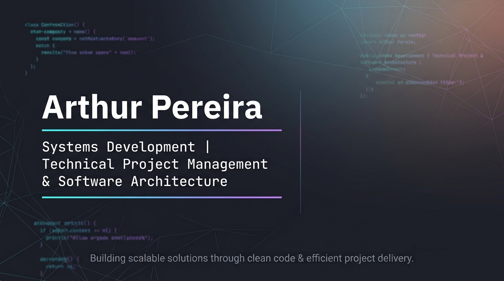

<div align="center">



</div>

# 👋 Hello, I'm Arthur Pereira

<div align="center">

### Systems Development Student | Future Software Engineer 🚀

Building my journey through programming, projects, and continuous learning.

</div>

---

## 📊 GitHub Stats

<div align="center">


</div>

---

## 🙋 About Me

🎓 I am a **Systems Development student**, passionate about technology and software development.

💻 I am mainly interested in **Software Engineering, Backend Development, and Software Architecture**, seeking to understand how to build organized, efficient, and scalable applications.

🚀 I aim to transform ideas and real-world problems into digital solutions by combining technical knowledge, organization, and creativity.

🌎 I believe technology has the power to improve processes, connect people, and create meaningful impact through well-designed solutions.

> "Technology transforms ideas into reality when knowledge, creativity, and purpose work together."

---

## 🚀 Currently Studying

I am currently building my foundation in software development, improving my ability to create well-structured and efficient applications.

My studies are focused on:

* 🐍 **Python and Object-Oriented Programming**
* 🗄️ **Database fundamentals and data modeling**
* 🌐 **Application development and system integration**
* 🧩 **Programming best practices and code organization**
* 📖 **Fundamental concepts for building quality software**

🎯 My goal is to continuously evolve, transforming knowledge into increasingly complete projects.

> "Great results are built through dedication to small daily improvements."

---

## 🛠️ Technologies

### 💻 Programming Languages

<div>


</div>

---

### 🌐 Web Development

<div>


</div>

---

### 🗄️ Database

<div>


</div>

---

### 🔧 Tools

<div>


</div>

---

## 📌 Featured Projects

### ☕ Café Horizonte

A cafeteria management system developed as a study project.

The project focuses on applying concepts such as:

* System modeling
* Object-Oriented Programming
* Code organization and structure

**Technologies:**

> Python • OOP • UML


> "Projects are the way knowledge becomes experience."

---

## 🎯 Goals

### 📍 Short Term

* Strengthen my programming and systems development knowledge.
* Build projects to apply concepts through practice.
* Improve my problem-solving skills through technology.
* Find an opportunity to start my professional experience in the field.

### 🚀 Medium Term

* Deepen my knowledge of software development.
* Participate in larger projects and collaborate with technology teams.
* Develop more complete, organized, and efficient applications.
* Continue growing as a software professional.

### 🌎 Long Term

* Become a professional capable of creating impactful and high-quality technology solutions.
* Work on the development of well-structured and relevant software systems.
* Continue learning and adapting to the constant evolution of technology.

---

## 📫 Contact

I am open to conversations about technology, projects, and opportunities.

💼 LinkedIn: [Arthur Pereira](https://www.linkedin.com/in/arthur-pereira-faria-tech/)

📧 Email: `arthur.faria.tech@gmail.com`

📧 [Send me an email](https://mail.google.com/mail/?view=cm&fs=1&to=arthur.faria.tech@gmail.com&su=Professional%20contact%20through%20GitHub)

<div align="center">

⭐ Thanks for visiting my profile!

</div>
```
