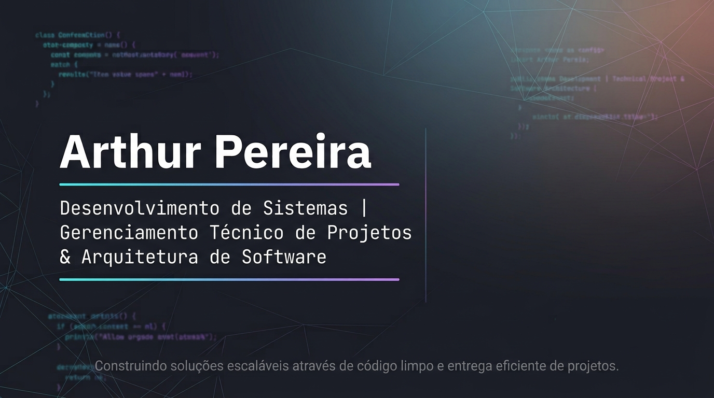

# 👋 Olá, eu sou Arthur Pereira

### Estudante de Desenvolvimento de Sistemas | Futuro Engenheiro de Software 🚀

Construindo minha jornada através de programação, projetos e aprendizado contínuo.

---

## 📊 GitHub Stats

---

## 🙋 Sobre mim

🎓 Sou estudante de **Desenvolvimento de Sistemas**, apaixonado por tecnologia e pelo desenvolvimento de soluções através da programação.

💻 Tenho interesse principalmente em **Engenharia de Software, Back-end e Arquitetura de Sistemas**, buscando compreender como criar aplicações organizadas, eficientes e escaláveis.

🚀 Busco transformar ideias e problemas reais em soluções digitais, unindo conhecimento técnico, organização e criatividade.

🌎 Acredito que a tecnologia possui o poder de melhorar processos, conectar pessoas e gerar impacto através de boas soluções.

>### "A tecnologia transforma ideias em realidade quando conhecimento, criatividade e propósito trabalham juntos."

---

## 🚀 Atualmente estudando

Atualmente estou construindo minha base em desenvolvimento de software, buscando evoluir minha capacidade de criar aplicações bem estruturadas e eficientes.

Meus estudos estão focados em:

* 🐍 **Python e Programação Orientada a Objetos**
* 🗄️ **Fundamentos de bancos de dados e modelagem de informações**
* 🌐 **Desenvolvimento de aplicações e integração entre sistemas**
* 🧩 **Boas práticas de programação e organização de código**
* 📖 **Conceitos fundamentais para construção de softwares de qualidade**

🎯 Meu objetivo é evoluir constantemente, transformando conhecimento em projetos cada vez mais completos.

>### "Grandes resultados são construídos através da dedicação aos pequenos aprendizados do dia a dia."

---

## 🛠️ Tecnologias

### 💻 Linguagens

---

### 🌐 Desenvolvimento Web

---

### 🗄️ Banco de Dados

---

### 🔧 Ferramentas

---

## 📌 Projetos em destaque

### ☕ Café Horizonte

Sistema de gerenciamento para uma cafeteria desenvolvido como projeto de estudo.

O projeto tem como objetivo aplicar conceitos de:

* Modelagem de sistemas
* Programação Orientada a Objetos
* Organização e estruturação de código

**Tecnologias utilizadas:**

#### Python • POO • UML

>### "Projetos são a forma de transformar conhecimento em experiência."

---

## 🎯 Objetivos

### 📍 Curto prazo

* Consolidar meus conhecimentos em programação e desenvolvimento de sistemas.
* Desenvolver projetos que me ajudem a aplicar conceitos na prática.
* Evoluir minha capacidade de resolver problemas através da tecnologia.
* Buscar uma oportunidade para iniciar minha experiência profissional na área.

### 🚀 Médio prazo

* Aprofundar meus conhecimentos em desenvolvimento de software.
* Participar de projetos maiores e colaborar com equipes de tecnologia.
* Desenvolver aplicações mais completas, organizadas e eficientes.
* Continuar evoluindo como profissional da área.

### 🌎 Longo prazo

* Tornar-me um profissional capaz de criar soluções de tecnologia com impacto e qualidade.
* Trabalhar no desenvolvimento de sistemas bem estruturados e relevantes.
* Continuar aprendendo e acompanhando a evolução constante da tecnologia.

---

## 📫 Contato

Estou aberto a conversar sobre tecnologia, projetos e oportunidades.

💼 LinkedIn: [Arthur Pereira](https://www.linkedin.com/in/arthur-pereira-faria-tech/)

📧 Email: `arthur.faria.tech@gmail.com`

📧 [Enviar e-mail](https://mail.google.com/mail/?view=cm&fs=1&to=arthur.faria.tech@gmail.com&su=Contato%20profissional%20pelo%20GitHub)

⭐ Obrigado por visitar meu perfil!

